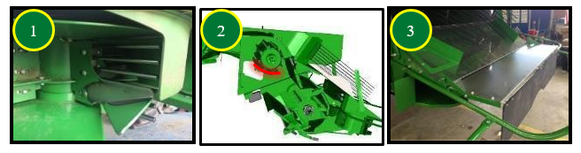

# Composants du système de résidus 

Les palettes incurvées nº 1 doivent être posées sur chaque deuxième segment de l’épandeur à disques Advanced PowerCast™. Le couvercle sous le tambour d'alimentation nº 2 ne doit pas être posé, car il peut entraîner un enroulement lors de la récolte de petites céréales. Un ralentisseur de chute nº 3 est disponible pour la configuration Premium afin d'améliorer la forme des andains et accélérer le séchage de la paille. 

