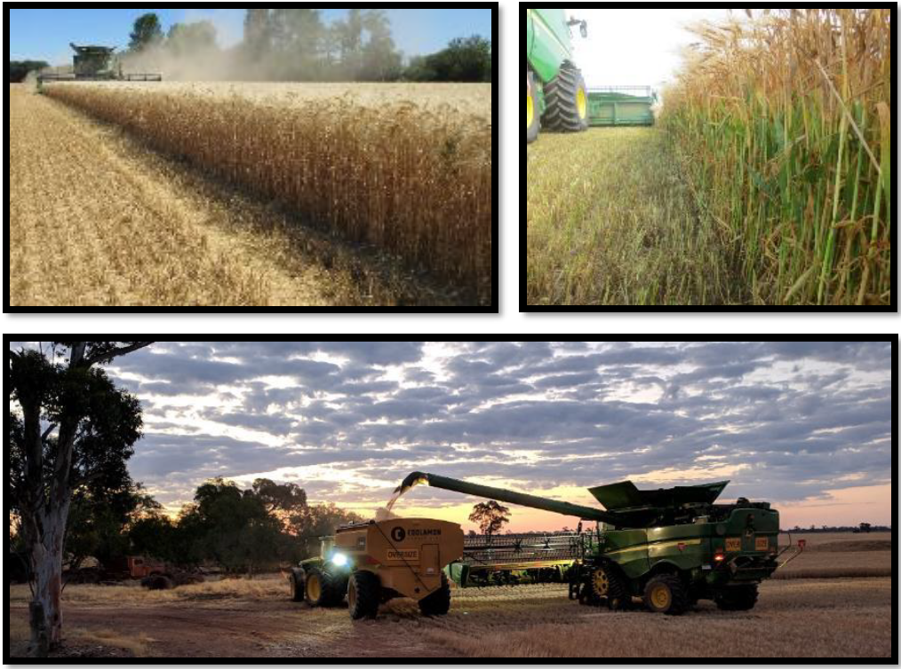

# Conseils et astuces

## Avant de commencer la récolte

### Facteurs influençant la récolte

Évaluez les paramètres suivants avant de procéder à la récolte :
* Type de culture,
* Rigidité de la paille,
* Volume de la paille,
    * Le rapport grain / matière autre que grain impacte les performances.
* Couleur de la paille,
   * La paille verte rend le battage plus difficile.
* Humidité de la paille,
* Humidité de l'air,
* Humidité de la plante.
    * Augmente du sommet vers la base.
    * Remarque : La hauteur de chaume influence le débit de récolte.
    
### Identifier l’origine des pertes
Vérifiez les éléments suivants :
   
   * Unité de récolte, 
   * Organes de battage,
   * Caisson de nettoyage,
   * Pertes avant moisson.

## Améliorer la productivité

### Répartition de la matière
Objectif : Assurer une distribution uniforme sur le caisson de nettoyage.

  1. Vérifiez en réalisant un STOP machine pendant la récolte.

  2. Ajuster les diviseurs des vis d’alimentation si nécessaire.

  3. Installez des couvercles sur les grilles de séparation du contre-batteur pour équilibrer la répartition.

### Faible rendement :

* Utilisez une unité de récolte plus large.
* Augmentez la vitesse d’avancement pour maintenir la machine chargée.

### Réglages cabine : 
* Vérifiez régulièrement que les valeurs affichées correspondent aux valeurs réelles (ex. ouverture de grille).

## Cas particuliers et résolution de problèmes

### Surcharge côté droit du caisson de nettoyage (temps sec) :

   * Relevez complètement le diviseur droit de la vis d’alimentation.
   * Installez des plaques d’obturation côté droit du contre-batteur si nécessaire.
   * La grille à ôtons doit être suffisamment ouverte.

### Variétés difficiles à battre
Utilisez la configuration de battage agressive suivante :
* Écartement du contre-batteur jusqu’à 5 mm,
* Contre-batteurs à petit fil,
* Plaques d’obturation.

### Paille très sèche et cassante 
Risque de surcharge du caisson de nettoyage.

   * Installez des plaques d’obturation.
   * Augmentez l’écartement du contre-batteur.
   * Réduisez le régime du rotor, tout en maintenant un battage efficace (min. 800 tr/min).
   
