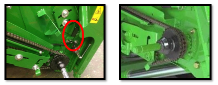
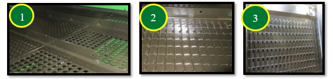

# Réglage et inspection de la moissonneuse-batteuse

## Hauteur, vitesse et position du tambour d'alimentation

* Position du tambour avant : Poignée vers le bas
* Vitesse de la chaîne du convoyeur : 32 dents pour les conditions de 
récolte de blé normales et difficiles, 26 dents dans des conditions sèches.

* Vitesse rapide par défaut. Par temps sec, abaisser la vitesse pour réduire
l’endommagement de la paille et de réduire la charge du caisson. 
 

## Contre-batteurs

Il est recommandé d'utiliser les contre-batteurs à petit fil nº 1 et à gros fil nº 2 pour 
les céréales. Ils offrent les meilleures performances. 

Configuration standard de la machine :
* Avant : Contre-batteur à petit fil
* Milieu : Contre-batteur à petit fil
* Arrière : Contre-batteur à grand fil 

Conditions de battage difficiles :
* Remplacez le contre-batteur du milieu par un contre-batteur à grand fil.

> Cela augmente le battage.  
* Remarque : Les contre-batteurs à mini barre ronde nº 3 doivent uniquement être utilisés 
dans des conditions difficiles lors de bourrages de contre-batteur, et lorsque 
les réglages machines ne suffisent plus. 

Reportez-vous au livret d'entretien pour la procédure de mise à niveau et le 
calibrage à zéro des contre-batteurs (de l'avant à l'arrière), ainsi que pour 
l'écartement par rapport aux éléments de battage. 

## Plaques d'obturation du contre-batteur

Généralement pas nécessaire grace aux performances de battage élevées du contre
batteur à petit fil et du rotor. 

Si le battage est insuffisant, installez les plaques dans l'ordre suivant, pour optimiser le traitement des otons :

| Modèles de machine | Ordre de pose  |
| :--- | :--- |
| **S660 et S670** | 1 → 4 → 5 → 2 → 3 |
| **S680 à S690** | 1 → 2 → 3 → 4 → 5 |

## Grilles de séparation

Les entretoises de la grille de séparation nº 1 doivent se trouver sur le 
rail pour l'orge. Cela permet d’avoir les grilles en position haute et 
d’assurer un flux constant de récolte via les organes de battage.  

### En cas de mauvaise répartition au caisson de nettoyage
Utilisez les couvercles de grille de séparation nº 2. Ils limitent la sortie de matière par l'extérieur du rotor. 

**Avant d'installer les couvercles :** Tentez d'abord d'équilibrer la répartition en réglant les diviseurs des vis d'alimentation. 

## Batteur d'otons et déflecteurs supérieurs réglables (suivant équipement) 

Le contre-batteur du batteur d'otons doit être en position fermée.

Les déflecteurs supérieurs du rotor doivent être en position standard. 

Conditions très sèches :
* Placer les déflecteurs supérieurs en position avancée. Cela améliore la qualité de la paille et réduit la charge du caisson.

## Réglages des organes de battage

| Organe | Condition de récolte | Réglage préconisé |
| :--- | :--- | :--- |
| **Régime du Rotor** | Sèches et cassantes | 850 tr/min |
| **Régime du Rotor** | Normales et difficiles | 950 tr/min |
| **Écartement Contre-batteur** | Sèches et faciles | 25 mm |
| **Écartement Contre-batteur** | Normales et difficiles | 15 mm |

> Ces réglages sont des points de départ. Dans des conditions de battage faciles, augmentez l'écartement du contre-batteur jusqu'à 30 mm pour préserver la qualité de paille.

## Composants du caisson de nettoyage 

### Configuration du caisson de nettoyage
Utilisation courante :
* Grille à otons universelle nº 1 
* Grille à grain universelle nº 3

Pour plus de performances :
* Grille à otons hautes performances nº 2.

> Trémie plus propre, réduction de la charge d'otons.

### Réglage des vis d'alimentation

* **Diviseurs (n°1) :** À ajuster pour une répartition uniforme sur le caisson.
* **Tôles de vis :** Relevez-les pour limiter la surcharge sur les côtés extérieurs.

## Réglages du caisson de nettoyage 

### Grille à otons
| Élément | Condition | Réglage |
| :--- | :--- | :--- |
| **Ouverture Grille** | Débit normal (7 t/ha) | 16 mm |
| **Ouverture Grille** | Débit élevé (10 t/ha) | 19 mm |
| **Extension** | Terrain plat | 5 mm |
| **Extension** | À flanc de coteau | 10 mm |

> Si vous utilisez une grille à otons hautes performance, ajoutez 2mm à l'ouverture. 

### Grille à grains
| Élément | Condition | Réglage |
| :--- | :--- | :--- |
| **Ouverture Grille** | Débit normal (7 t/ha) | 6 mm |
| **Ouverture Grille** | Débit élevé (10 t/ha) | 8 mm |
| **Pré-grille réglable** | Toutes conditions | Ouverture MAX |

### Ventilateur
| Élément | Condition | Réglage |
| :--- | :--- | :--- |
| **Régime Ventilateur** | Débit normal (7 t/ha) | 1150 tr/min |
| **Régime Ventilateur** | Débit élevé (10 t/ha) | 1250 tr/min |

> Si vous utilisez une grille à otons hautes performance, augmentez le régime du ventilateur de 100 tr/min.
> 

## Transport du grain

Réglages permettant d’optimiser le remplissage de la trémie à grain.

* **Couvercles de vis transversale** : maintenir en position relevée.

* **Exception** : abaisser uniquement si l’humidité de la récolte > 24 %.

* **Déflecteur (vis de remplissage de la trémie)** : réglable pour adapter la répartition du grain.

* **Position illustrée** : chargement de la trémie décalé vers la droite.

## Composants du système de résidus

Réglages et configuration des composants du système d’épandage.

* **Palettes incurvées n°1** : installer sur un segment sur deux de l’épandeur à disques Advanced PowerCast™.

* **Couvercle sous le tambour d’alimentation n°2** : ne pas installer lors de la récolte de petites céréales (risque d’enroulement).

* **Ralentisseur de chute n°3** : option configuration Premium ; améliore la forme des andains et le séchage de la paille.

## Réglages des résidus

Réglages du broyeur et des déflecteurs pour gérer la répartition et la qualité de broyage.

* **Régime du broyeur n°1** : régler sur élevé.

* **Contre-couteaux n°2** : enclencher uniquement si nécessaire pour éviter une consommation d’énergie inutile.

* **Barre d’ancrage n°3** : installer sur le plancher du broyeur à coupe fine (44 couteaux) pour améliorer la qualité de broyage.

## Répartition des résidus

* **Déflecteur de rafles n°1** : position relevée / petites céréales.
* **Ailettes du déflecteur arrière ou volet de broyage/andainage n°2** : réglables pour améliorer la répartition des résidus.
