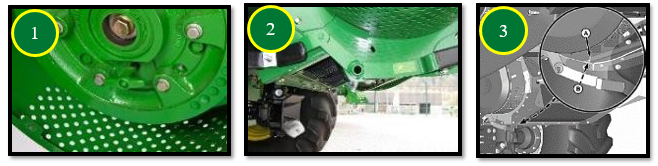

# Réglages des résidus

Réglages du broyeur et des déflecteurs pour gérer la répartition et la qualité de broyage.

* **Régime du broyeur n°1** : régler sur élevé.

* **Contre-couteaux n°2** : enclencher uniquement si nécessaire pour éviter une consommation d’énergie inutile.

* **Barre d’ancrage n°3** : installer sur le plancher du broyeur à coupe fine (44 couteaux) pour améliorer la qualité de broyage.

