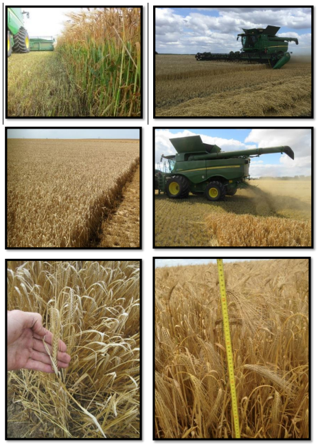

# Conseils et astuces

## Conseils de réglage
-  Le type de culture et les conditions ont une influence considérable
sur la productivité et les réglages de la machine. Évaluez-les bien
avant de commencer la récolte. La
capacité de battage, la rigidité de la paille et sa teneur en
humidité ont un impact important sur les réglages de la machine pour l'orge en particulier.
- La meilleure façon de vérifier si le temps de battage est suffisant
est de faire un andain et de rechercher des grains non battus.
- Déterminer l’origine des pertes est essentiel pour prendre les
mesures adéquates (Pertes au niveau de l'unité de récolte, des
organes de battage, du caisson de nettoyage ou des pertes
d‘avant moisson).
- Les réglages faits en cabines sont précis uniquement si les
calibrations sont correctes. Contrôlez fréquemment que les
“valeurs cabines” correspondent bien aux valeurs réelles (ex:
ouverture grille otons…)  

## Conseils de récolte

- Le volume de paille qui passe par la moissonneuse-batteuse a une
influence considérable sur la productivité. Le rapport
céréales/matière autre que grain a un impact très important sur
les performances de récolte.  
- Une paille verte et humide rend le battage plus difficile.  
- La partie basse des plantes a une teneur en humidité plus importante que le haut de la plante. La hauteur de chaumes a donc un impact important sur le
débit de céréales.  (Plus la plante est haute, plus elle est sèche, et plus le battage s'effectue facilement.)

