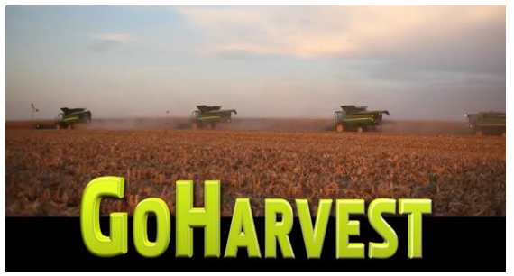

# Outils et liens

Télécharger l'application GoHarvest pour plus d'informations sur les
réglages, le calculateur de perte, JDParts, les vidéos, les procedures…

Accéder au lien de GoHarvest sur YouTube pour consulter des vidéos
détaillées sur la procédure de STOP de la machine, CombineAdvisor,
Active Terrain Adjustment et bien plus encore. 

