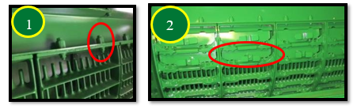
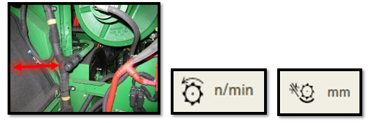

# Réglage et inspection de la moissonneuse-batteuse
Il est important de régler la mosissonneuse-batteuse afin d'éviter des pertes de grains piégés dans la couche de menue paille sur la grille à otons car le grain moins lisse que le blé reste bloqué dans la menue paille.  
## Hauteur du tambour et vitesse du convoyeur

* Position du tambour avant - Poignée vers le bas pour l'orge
* Vitesse du convoyeur – 32 dents pour les conditions de récolte d'orge normales et difficiles, 26 dents dans des conditions sèches.

## Vitesse du tambour d‘alimentation

Vitesse rapide pour les conditions normales et difficiles. Dans des conditions sèches et cassantes, la vitesse peut être abaissée afin de limiter l'endommagement de la paille et de réduire la charge du caisson.

## Contre-batteurs

Les contre-batteurs à petit fil nº 1 et à gros fil nº 2 sont recommandés pour les céréales et offrent les meilleures performances.

La configuration standard de la machine comporte un contre-batteur à petit fil à l'avant, un contre-batteur à petit fil au milieu et un contre-batteur à grand fil à l'arrière.

Dans des conditions de battage difficiles, le contre-batteur du milieu peut être remplacé par un contre-batteur à grand fil pour augmenter le battage.

Les contre-batteurs à mini barre ronde nº 3 doivent uniquement être utilisés dans des conditions difficiles lors de bourrages de contre-batteur, et lorsque les réglages machines ne suffisent plus.

Se reporter au livret d'entretien pour la procédure de mise à niveau et le calibrage à zéro des contre-batteurs (de l'avant à l'arrière), ainsi que pour l'écartement par rapport aux éléments de battage.

> **Remarque :** Les variétés difficiles à battre exigent une configuration agressive
des organes de battage. Pour ces variétés, les écartements de
contre-batteur pouvant descendre jusqu'à 5mm, en utilisant de surcroît des contre-batteurs à petit fil et des plaques d’obturation. Si les épis d'orge
ne sont pas complètement battus ou si les barbes restent sur le
grain, le caisson de nettoyage ne peut pas fonctionner
efficacement.

## Plaques d'obturation du contre-batteur

Des plaques d'obturation de contre-batteur ne seront probablement pas nécessaires en raison des performances de battage élevées du contre-batteur à petit fil et du rotor.

S'ils s'avèrent nécessaires, ils doivent être posés dans l'ordre suivant en raison de la manière dont les retours des otons sont traités. Pour SX60 et SX70, positions 1, 4, 5, 2, 3. De SX80 à SX90, position 1, 2, 3, 4, 5.

## Grilles de séparation

S'assurer que les entretoises de la grille de séparation nº 1 se trouvent sur le rail pour l'orge. Cela permettra d’avoir les grilles en position haute, afin d’assurer un flux constant de récolte via les organes de battage. Utiliser les couvercles de grille de séparation nº 2 uniquement lorsque la répartition au caisson de nettoyage est inégale. Ils permettent de réduire la quantité de matière sortant du rotor sur l'extérieur. Avant de les poser, tenter d'obtenir une répartition uniforme du caisson de nettoyage en réglant les diviseurs des vis d'alimentation.

## Batteur d'otons et déflecteurs supérieurs réglables (suivant équipement)

Le contre-batteur du batteur d'otons doit être en position fermée (céréales). Si les céréales sont sujet à la “casse”, le contre-batteur peut également fonctionner en position ouverte (maïs).

Les déflecteurs supérieurs du rotor doivent être en position standard. En conditions très sèches ils peuvent être placés en position avancée pour améliorer la qualité de la paille et réduire la charge du caisson.

NDLR/BM: pas assez spécifique à l'équipement ou à la céréale, changer éléments non spécifiques ou rendre le tout plus général pour faire une doc pour l'ensemble

Plutôt partisane d'avoir doc spécifique à chaque céréale parce que plsu intéressant pour usager de pouvoir info pour son cas particulier 

## Réglages des organes de battage

Le rotor doit être réglé sur un régime rapide.

| Paramètre à régler | Réglage à effectuer | Conditions de battage|
|---|---|---|
| Régime du rotor | 830 tr/min | Conditions sèches et cassantes |
| Régime du rotor | 930 tr/min | Conditions normales et difficiles |
| Écartement du contre-batteur| 25 mm |Conditions sèches et faciles |
| Écartement du contre-batteur | 13 mm | Conditions normales et difficiles |

Ces recommandations de réglages constituent un point de départ et devront probablement être encore optimisées.

## Composants du caisson de nettoyage

La grille à otons universelle nº 1 et la grille à grain universelle nº 3 sont
couramment utilisées. Il est possible de poser une grille à otons hautes
performances nº 2, qui permet d'obtenir un échantillon de trémie plus
propre et une réduction de la charge d'otons lorsque que les performances
sont limitées par le caisson de nettoyage

Les diviseurs des vis d'alimentation nº 1 doivent être réglés pour obtenir une
répartition uniforme du caisson de nettoyage. Le relevage des tôles permet
de réduire la quantité de matière à l'extérieur. Il est également possible de
poser une pré-grille à otons réglable nº 2, qui empêche l'accumulation de
tiges dans la grille, lors de la récolte de colza et de tournesol. La pré-grille à
ôtons réglable n'offre aucun avantage pour l'orge. L'extension de pré-grille à
otons nº 3, n'est pas livrée avec les machines ZX et ne doit pas être posée
pour l'orge

##  Réglages du caisson de nettoyage

| Paramètre à régler | Réglage à effectuer | Débit |
|---|---|---|
|Ouverture de la grille à otons | 16 mm | Débit normal (SX70 à 6 t/ha) | 
| Ouverture de la grille à otons | 18 mm | Débit élevé (SX90 à 8 t/ha) | 

L'ouverture de la grille à otons doit être supérieure de 2 mm en cas de pose de la grille à otons hautes performances  
|---|---|---|
| Extension de la grille à otons | 5 mm | Sur terrain plat  
Extension de la grille à otons – 10 mm – À flanc de coteau  
Ouverture de la grille à grain – 6 mm – Débit normal (SX70 à 6 t/ha)  
Ouverture de la grille à grain – 9 mm – Débit élevé (SX90 à 8 t/ha)  
L'ouverture de la grille à grain doit être supérieure de 1 mm en cas de pose
de la grille à otons hautes performances  
Régime du ventilateur – 950 tr/min - Débit normal (SX70 à 6 t/ha)  
Régime du ventilateur – 1050 tr/min - Débit élevé (SX90 à 8 t/ha)  
Le régime du ventilateur doit être supérieur de 100 tr/min avec une grille à
otons hautes performances  
Suivant équipement, la pré-grille à otons réglable doit être réglée sur
l'ouverture maximale.

## Réglages pour préserver le caisson de nettoyage
>**Important :** Assurez-vous que la répartition de la matière est uniforme sur le
caisson de nettoyage. Pour ce faire,
effectuez un STOP de la machine pendant la récolte (pour la
procédure d’arrêt, demandez conseil à votre concessionaire)

- De la paille très sèche et cassante peut entraîner une surcharge
du caisson de nettoyage. Pour limiter ce problème, monter des
plaques d’obturation, agrandir l'écartement du contre-batteur et
ralentir le rotor à un régime ou le battage est effectué. (min. 800
tr/min).
- Pour équilibrer la répartion, réalisez des ajustements
au niveau des diviseurs et des vis d'alimentation. Des couvercles
peuvent être installés sur les grilles de separation du
contrebatteur.  
- Dans des conditions de faible rendement, des largeurs d'unité de
récolte et des vitesses de déplacement plus importantes permettent de maintenir la machine "chargée" pour permettre le
battage.  

## Transport du grain

Les couvercles de vis transversale doivent être en position relevée. Le
déflecteur au niveau de la vis de remplissage de la trémie à grain peut être
réglé pour modifier le chargement de la trémie à grain. La position illustrée
permet de charger la trémie à grain plus à droite.

## Composants du système de résidus

Les palettes incurvées nº 1 doivent être posées sur chaque deuxième
segment de l’épandeur à disques Advanced PowerCast™. Le couvercle sous le
tambour d'alimentation nº 2 ne doit pas être posé, car il peut entraîner un
enroulement lors de la récolte de petites céréales. Un ralentisseur de chute
nº 3 est disponible pour la configuration Premium afin d'améliorer la forme
des andains et accélérer le séchage de la paille.

## Réglages des résidus

Le régime du broyeur nº 1 doit être réglé sur élevé. Les contre-couteaux nº 2
doivent être enclenchés uniquement si nécessaire afin d'éviter toute
consommation d'énergie inutile. Il est possible de poser une barre d'ancrage
nº 3 sur le plancher du broyeur à coupe fine (44 couteaux) pour augmenter la
qualité de broyage.

Le déflecteur de rafles nº 1 doit être en position relevée/céréales. Les ailettes
du déflecteur arrière ou du volet de broyage/andainage nº 2 sont réglables
afin d'améliorer la répartition des résidus.

