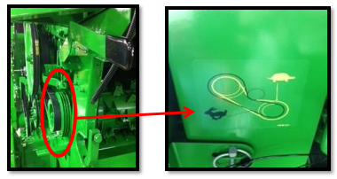
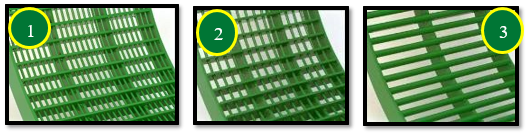
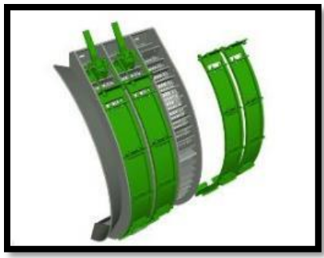
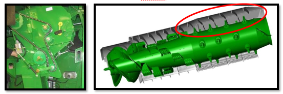
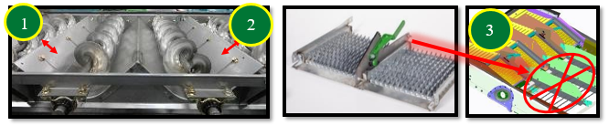
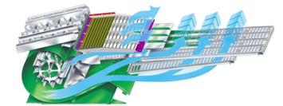
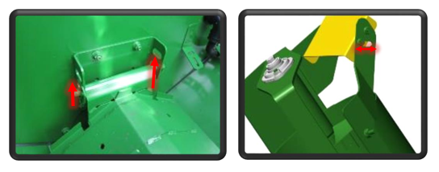
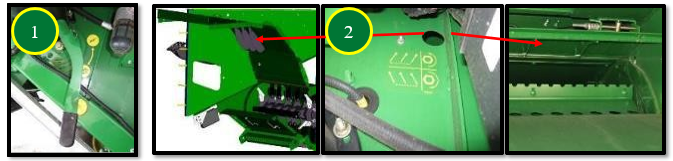

# Réglage et inspection de la moissonneuse-batteuse (Tournesol)

## Convoyeur d’alimentation

### Hauteur et position du tambour
- Placer la poignée du tambour avant en position haute pour la récolte du tournesol.

### Vitesse du convoyeur
- Régler sur 26 dents pour une alimentation adaptée au tournesol.

---

## Vitesse du tambour d’alimentation

- Réglage standard : 550 tr/min (conditions normales à difficiles)
- En conditions sèches et cassantes :
  - Réduire à 320 tr/min avec le kit BXE10741
  - Permet de :
    - limiter l’endommagement de la paille
    - réduire la charge du caisson de nettoyage

- Le pignon 770 tr/min du kit peut être utilisé pour les petites céréales.

---

## Contre-batteurs

- Conditions difficiles :
  - utiliser 3 contre-batteurs à grand fil nº 2

- Conditions faciles :
  - utiliser 3 contre-batteurs à barre ronde nº 3

Le battage des tournesols ne pose généralement pas de difficulté.

> Se référer au livret d’entretien pour la mise à niveau, le calibrage à zéro et le réglage de l’écartement.

---

## Plaques d’obturation du contre-batteur

Les plaques permettent de contrôler le flux de matière vers le caisson de nettoyage et d’améliorer la répartition.

- Plaques nº 1 (BH84534) → contre-batteurs à grand fil
- Plaques nº 2 (BH84535) → contre-batteurs à barre ronde

---

## Grilles de séparation

- Positionner les entretoises nº 1 sur le rail tournesol
  - Permet une position haute des grilles
  - Assure un flux régulier

- Utiliser les couvercles nº 2 uniquement si nécessaire :
  - en cas de mauvaise répartition
  - pour réduire la charge du caisson

---

## Batteur d’otons et déflecteurs

- Contre-batteur du batteur d’otons :
  - position ouverte (réglage maïs)

- Déflecteurs supérieurs :
  - position standard
  - position avancée uniquement en cas de surcharge du caisson

---

## Réglages des organes de battage

- Régime du rotor :
  - 500 tr/min (conditions sèches)

- Écartement du contre-batteur :
  - 30 mm (conditions normales)
  - jusqu’à 40 mm en conditions faciles

Ces réglages constituent un point de départ et doivent être ajustés selon les conditions réelles.

---

## Caisson de nettoyage – composants

- Grilles standard :
  - grille à otons universelle nº 1
  - grille à grain universelle nº 3

- Option :
  - grille à otons haute performance nº 2
    - améliore la propreté de l’échantillon
    - réduit la charge

### Répartition
- Ajuster les diviseurs de vis
- Relever les tôles pour limiter la matière sur l’extérieur

### Options supplémentaires
- Pré-grille réglable : limite l’accumulation de tiges
- Extension de pré-grille nº 3 : ne pas utiliser pour le tournesol

---

## Réglages du caisson de nettoyage

- Grille à otons : 14 mm
  - +2 mm avec grille haute performance

- Extension de grille : 0 mm

- Grille à grain : 5 mm
  - +1 mm avec grille haute performance

- Ventilateur : 780 tr/min
  - augmenter si grille haute performance

- Pré-grille réglable : 6 mm

Le système Active Terrain Adjustment est recommandé pour améliorer la qualité de l’échantillon et gérer le volume d’otons.

---

## Transport du grain

- Relever les couvercles de vis transversale
- Ajuster le déflecteur de remplissage pour orienter le chargement de la trémie

---

## Gestion des résidus – composants

- Installer les palettes incurvées nº 1 (1 segment sur 2)
- Ne pas installer le couvercle nº 2 (risque d’enroulement)
- Option :
  - ralentisseur de chute nº 3 :
    - améliore les andains
    - accélère le séchage

---

## Réglages des résidus

- Broyeur : régime élevé
- Contre-couteaux :
  - activer uniquement si nécessaire

### Déflecteurs
- Déflecteur de rafles : position haute
- Ailettes réglables pour améliorer la répartition

