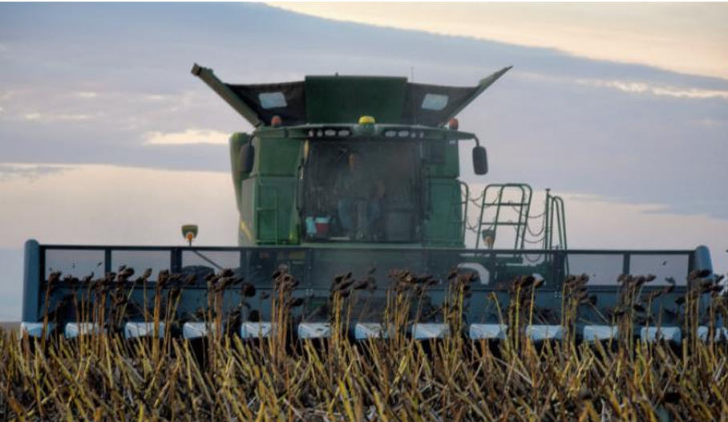

# Rapport des modifications 

## 1. Type de culture choisi

Le travail a été réalisé sur la culture du tournesol.

## 2. Restructuration du contenu

J'ai ajouté des espaces manquants après les ## 

Titre : Pret pour la récolte pour les tournsols > Objectif de la documentation

ajouter des numéros aux titres pour plus de clarté et TDM

enelver ##Préface

ajout de lien conseils et astuce puis minimalisme

topic 2: 2. Réglage et inspection de la moissonneuse-batteuse enlever moissoneuse b
enlever "pour les tournesols." car on sait

partie contrebatteurs : liste à puce et enelver "egalement" et de commenataire "généralement pas de pb", ajout d'une note

contre batteur une ligne dintro

grille séparation en liste comme limage

corriger et améliorer entre 20 et 30 phrases/paragraphes du contenu existant

